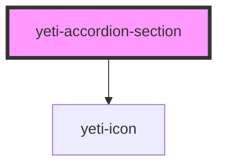

# yeti-accordion-section

<!-- Auto Generated Below -->

## Properties

| Property     | Attribute      | Description                                                                                                         | Type      | Default                    |
| ------------ | -------------- | ------------------------------------------------------------------------------------------------------------------- | --------- | -------------------------- |
| `hasActions` | `has-actions`  | Whether the consumer supplied buttons or not. Let the component set this.                                           | `boolean` | `false`                    |
| `heading`    | `heading`      | The descriptive text that appears in the heading bar above the content.                                             | `string`  | `'Heading'`                |
| `headingId`  | `heading-id`   | The heading button's HTML id.                                                                                       | `string`  | `utils.generateUniqueId()` |
| `index`      | `index`        | The 0-based index of this section relative to its peers. This should only be set by the parent Accordion component. | `number`  | `0`                        |
| `isInWizard` | `is-in-wizard` | Whether the panel is a step in a wizard or not. This should be set by the parent Accordion component.               | `boolean` | `false`                    |
| `isNumbered` | `is-numbered`  | Whether or not to automatically number the section headings                                                         | `boolean` | `true`                     |
| `isOpen`     | `is-open`      | Whether the panel is open or not.                                                                                   | `boolean` | `(this.index == 0)`        |
| `isOpenable` | `is-openable`  | Whether the panel is openable or not.                                                                               | `boolean` | `(this.index == 0)`        |
| `of`         | `of`           | The total number of sections the parent Accordion has. Should only be set by the parent.                            | `number`  | `1`                        |
| `sectionId`  | `section-id`   | The section's HTML id.                                                                                              | `string`  | `utils.generateUniqueId()` |
| `status`     | `status`       | The panel's status: can be "success", "error", "reachable", or "undefined".                                         | `string`  | `"undefined"`              |

## Events

| Event                         | Description | Type               |
| ----------------------------- | ----------- | ------------------ |
| `accordionActionClick`        |             | `CustomEvent<any>` |
| `accordionSectionHeaderClick` |             | `CustomEvent<any>` |

## Dependencies

### Depends on

- [yeti-icon](../yeti-icon)

### Graph

----------------------------------------------

*Built with [StencilJS](https://stenciljs.com/)*
