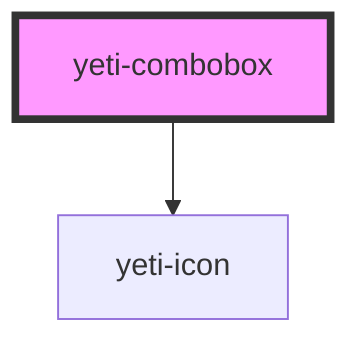

# yeti-multiselect

<!-- Auto Generated Below -->

## Properties

| Property           | Attribute           | Description                                                                                                                           | Type      | Default        |
| ------------------ | ------------------- | ------------------------------------------------------------------------------------------------------------------------------------- | --------- | -------------- |
| `inputDescribedBy` | `input-describedby` | Optionally provide the id of a describing element (like an input tip).                                                                | `string`  | `""`           |
| `inputId`          | `input-id`          | Optionally provide an id for the combobox element.                                                                                    | `string`  | `""`           |
| `inputName`        | `input-name`        | Optionally provide a form element name.                                                                                               | `string`  | `""`           |
| `isValid`          | `is-valid`          | Whether the component has a valid value.                                                                                              | `boolean` | `undefined`    |
| `menuAlignment`    | `menu-alignment`    | Token list of left \| right and/or above \| below that describes the drop-down's visual position relative to the closed state anchor. | `string`  | `""`           |
| `placeholder`      | `placeholder`       | Text that appears in the closed state/anchor when there are no selections.                                                            | `string`  | `"- Select -"` |
| `required`         | `required`          | Whether the component requires a valid value.                                                                                         | `boolean` | `false`        |
| `showClear`        | `show-clear`        | Whether or not to show the optional Clear all selections puck.                                                                        | `boolean` | `true`         |
| `value`            | `value`             | The component's value.                                                                                                                | `string`  | `''`           |
| `wrapperCss`       | `wrapper-class`     | CSS classlist to add to the component's outer wrapper element.                                                                        | `string`  | `''`           |

## Events

| Event               | Description                                                                                       | Type                            |
| ------------------- | ------------------------------------------------------------------------------------------------- | ------------------------------- |
| `readyToVerifyFast` | Fires when the user clicks an option or types in the input field.                                 | `CustomEvent<CustomEvent<any>>` |
| `readyToVerifySlow` | Fires when the user has made a selection and closed the dropdown (usually by focusing elsewhere). | `CustomEvent<CustomEvent<any>>` |

## Dependencies

### Depends on

- [yeti-icon](../yeti-icon)

### Graph

----------------------------------------------

*Built with [StencilJS](https://stenciljs.com/)*
