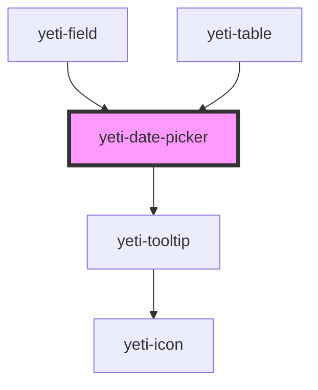

# yeti-date-picker

<!-- Auto Generated Below -->

## Properties

| Property           | Attribute            | Description                                                                                                        | Type      | Default                                  |
| ------------------ | -------------------- | ------------------------------------------------------------------------------------------------------------------ | --------- | ---------------------------------------- |
| `describedBy`      | `described-by`       | ID of any related describing element. Used by aria-describedby.                                                    | `string`  | `""`                                     |
| `inputClass`       | `input-class`        | CSS classlist that will be added to the actual HTML input element.                                                 | `string`  | `''`                                     |
| `inputId`          | `input-id`           | id that will be assigned to the actual HTML input element. If not provided, the component will assign one on load. | `string`  | `""`                                     |
| `inputName`        | `input-name`         | name that will be assigned to the actual HTML input element. If not provided, the component will use the id.       | `string`  | `""`                                     |
| `isValid`          | `is-valid`           | Tracks whether the component's current value is valid. The default empty value is valid.                           | `boolean` | `undefined`                              |
| `labeledBy`        | `labeled-by`         | ID of any related label for the component. Used by aria-labeledby.                                                 | `string`  | `""`                                     |
| `required`         | `required`           | Whether the component is a required field.                                                                         | `boolean` | `false`                                  |
| `showErrorTooltip` | `show-error-tooltip` | If true, shows a Tooltip that elaborates on an existing error.                                                     | `boolean` | `false`                                  |
| `tooltipText`      | `tooltip-text`       | The text to show in error tooltip (if it's used).                                                                  | `string`  | `"Enter the date in mm/dd/yyyy format."` |
| `value`            | `value`              | The component's value.                                                                                             | `string`  | `''`                                     |

## Events

| Event               | Description                                                                                                         | Type                            |
| ------------------- | ------------------------------------------------------------------------------------------------------------------- | ------------------------------- |
| `readyToVerifySlow` | Fires when the user has chosen or entered a date and either hit the enter key or left (blurred from) the component. | `CustomEvent<CustomEvent<any>>` |

## Dependencies

### Used by

 - [yeti-field](../yeti-field)
 - [yeti-table](../yeti-table)

### Depends on

- [yeti-tooltip](../yeti-tooltip)

### Graph

----------------------------------------------

*Built with [StencilJS](https://stenciljs.com/)*
