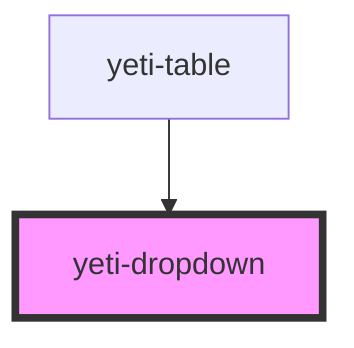

# yeti-multiselect

<!-- Auto Generated Below -->

## Properties

| Property        | Attribute        | Description                                                                                                                           | Type      | Default        |
| --------------- | ---------------- | ------------------------------------------------------------------------------------------------------------------------------------- | --------- | -------------- |
| `comboboxId`    | `html-id`        | id of the root html element.                                                                                                          | `string`  | `""`           |
| `describedBy`   | `described-by`   | id of an external HTML element that the component's actual drop-down element references in aria-describedby.                          | `string`  | `""`           |
| `flyoutId`      | `flyout-id`      | id of the drop-down element.                                                                                                          | `string`  | `""`           |
| `formName`      | `form-name`      | form's name for the actual drop-down element. Defaults to match id.                                                                   | `string`  | `""`           |
| `isValid`       | `is-valid`       | Whether the component has a valid value.                                                                                              | `boolean` | `true`         |
| `labelledBy`    | `labelled-by`    | id of an external HTML element that the component's actual drop-down element references in aria-labelledby.                           | `string`  | `""`           |
| `menuAlignment` | `menu-alignment` | Token list of left \| right and/or above \| below that describes the drop-down's visual position relative to the closed state anchor. | `string`  | `""`           |
| `placeholder`   | `placeholder`    | Text that appears in the closed state/anchor when there are no selections.                                                            | `string`  | `"- Select -"` |
| `required`      | `required`       | Whether the component requires a valid value.                                                                                         | `boolean` | `false`        |
| `showClear`     | `show-clear`     | Whether or not to show the optional Clear all selections puck.                                                                        | `boolean` | `true`         |
| `value`         | `value`          | The component's value is represented as a string of comma-separated values.                                                           | `string`  | `''`           |
| `wrapperClass`  | `wrapper-class`  | CSS classlist to add to the component's outer wrapper element.                                                                        | `string`  | `''`           |

## Events

| Event               | Description                                                                                       | Type                            |
| ------------------- | ------------------------------------------------------------------------------------------------- | ------------------------------- |
| `readyToVerifyFast` | Fires when the user toggles any of the options.                                                   | `CustomEvent<CustomEvent<any>>` |
| `readyToVerifySlow` | Fires when the user has made a selection and closed the dropdown (usually by focusing elsewhere). | `CustomEvent<CustomEvent<any>>` |

## Dependencies

### Used by

 - [yeti-table](../yeti-table)

### Graph

----------------------------------------------

*Built with [StencilJS](https://stenciljs.com/)*
