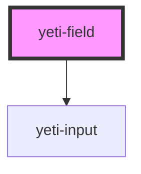

# yeti-form-field

<!-- Auto Generated Below -->

## Properties

| Property             | Attribute       | Description | Type      | Default                               |
| -------------------- | --------------- | ----------- | --------- | ------------------------------------- |
| `errorMessage`       | `error-message` |             | `string`  | `'Error: please correct this field.'` |
| `inputId`            | `input-id`      |             | `string`  | `utils.generateUniqueId()`            |
| `inputValue`         | `input-value`   |             | `string`  | `''`                                  |
| `isValid`            | `is-valid`      |             | `boolean` | `true`                                |
| `label` _(required)_ | `label`         |             | `string`  | `undefined`                           |
| `required`           | `required`      |             | `boolean` | `false`                               |
| `tip`                | `tip`           |             | `string`  | `undefined`                           |
| `value`              | `value`         |             | `string`  | `''`                                  |

## Dependencies

### Depends on

- [yeti-input](../yeti-input)

### Graph

----------------------------------------------

*Built with [StencilJS](https://stenciljs.com/)*
