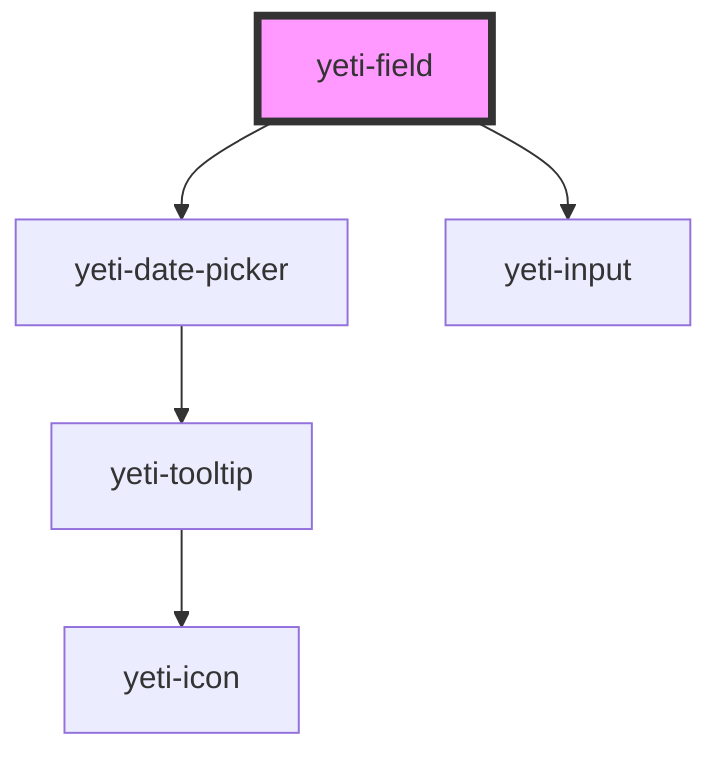

# yeti-field

<!-- Auto Generated Below -->

## Properties

| Property             | Attribute         | Description                                                                                                                    | Type      | Default                               |
| -------------------- | ----------------- | ------------------------------------------------------------------------------------------------------------------------------ | --------- | ------------------------------------- |
| `autovalidate`       | `autovalidate`    | Determines whether the field should attempt to validate itself or merely pass through any readyToVerify events from its input. | `boolean` | `true`                                |
| `defaultValue`       | `default-value`   | Default value of the field's input.                                                                                            | `string`  | `''`                                  |
| `errorMessage`       | `error-message`   | Error message that appears when the field is invalid. Can be updated at any time.                                              | `string`  | `'Error: please correct this field.'` |
| `fieldClass`         | `field-class`     | CSS classlist that will be assigned to the containing field element (probably a div).                                          | `string`  | `""`                                  |
| `inputId`            | `input-id`        | id that will be assigned to the actual input element. A unique one will be assigned if one is not provided.                    | `string`  | `utils.generateUniqueId()`            |
| `inputMaxlength`     | `input-maxlength` | maximum length for the field.                                                                                                  | `number`  | `0`                                   |
| `inputName`          | `input-name`      | name that will be assigned to the actual input element. id will be assigned if one is not provided.                            | `string`  | `this.inputId`                        |
| `isInline`           | `is-inline`       | Determines whether the field uses block (default) or inline labels.                                                            | `boolean` | `false`                               |
| `isValid`            | `is-valid`        | Whether the input is currently valid or invalid.                                                                               | `boolean` | `true`                                |
| `label` _(required)_ | `label`           | Mandatory value for the label of the field.                                                                                    | `string`  | `undefined`                           |
| `required`           | `required`        | Whether the field is required to have a valid value by the greater form.                                                       | `boolean` | `false`                               |
| `tip`                | `tip`             | Value for the optional input tip that appears at the bottom of the field.                                                      | `string`  | `""`                                  |
| `tipPosition`        | `tip-position`    | Position of the input tip relative to the rest of the field's contents. Defaults to "below", can also be "above".              | `string`  | `"below"`                             |
| `type`               | `type`            | type that will be assigned to the actual input element.                                                                        | `string`  | `"text"`                              |
| `wrapperClass`       | `wrapper-class`   | Additional user-supplied CSS classes to apply to the Field's wrapper.                                                          | `string`  | `""`                                  |

## Dependencies

### Depends on

- [yeti-date-picker](../yeti-date-picker)
- [yeti-input](../yeti-input)

### Graph

----------------------------------------------

*Built with [StencilJS](https://stenciljs.com/)*
