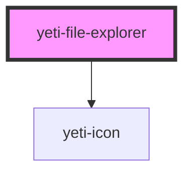

# yeti-file-explorer

<!-- Auto Generated Below -->

## Properties

| Property              | Attribute               | Description                                              | Type                   | Default                                                                                                                                                                                                                                                                                                                                                                                                                                                                                                                                                                                                                                                                                                                                                                                                                                                                                                                                                                                                                                                                                                                                                                                                                                                                                                                                                                                                       |
| --------------------- | ----------------------- | -------------------------------------------------------- | ---------------------- | ------------------------------------------------------------------------------------------------------------------------------------------------------------------------------------------------------------------------------------------------------------------------------------------------------------------------------------------------------------------------------------------------------------------------------------------------------------------------------------------------------------------------------------------------------------------------------------------------------------------------------------------------------------------------------------------------------------------------------------------------------------------------------------------------------------------------------------------------------------------------------------------------------------------------------------------------------------------------------------------------------------------------------------------------------------------------------------------------------------------------------------------------------------------------------------------------------------------------------------------------------------------------------------------------------------------------------------------------------------------------------------------------------------- |
| `minimumDisplayDepth` | `minimum-display-depth` | minimum number of folder layers to show                  | `number`               | `3`                                                                                                                                                                                                                                                                                                                                                                                                                                                                                                                                                                                                                                                                                                                                                                                                                                                                                                                                                                                                                                                                                                                                                                                                                                                                                                                                                                                                           |
| `path`                | --                      | All the displayed folders in order from root to terminus | `YetiFileSystemItem[]` | `[     {       name: "root",       content: [         {           name: "subfolder1",           content: [],           path: "//subfolder1",           isFolder: true,           isRoot: false,           isSelected: false,           selectedIndex: -1,           offset: 0,           pageSize: 1000,           totalElements: 0,           id: utils.generateUniqueId(),           type: "folder"         },         {           name: "subfolder2",           content: [],           path: "//subfolder2",           isFolder: true,           isRoot: false,           isSelected: false,           selectedIndex: -1,           offset: 0,           pageSize: 1000,           totalElements: 0,           id: utils.generateUniqueId(),           type: "folder"         },         {           name: "subfolder3",           content: [],           path: "//subfolder3",           isFolder: true,           isRoot: false,           isSelected: false,           selectedIndex: -1,           offset: 0,           pageSize: 1000,           totalElements: 0,           id: utils.generateUniqueId(),           type: "folder"         },       ],       path: "",       isFolder: true,       isRoot: true,       isSelected: true,       selectedIndex: -1,       offset: 0,       pageSize: 1000,       totalElements: 3,       id: utils.generateUniqueId(),       type: "folder"     }   ]` |
| `showFiles`           | `show-files`            | Whether or not to show files (folders are always shown). | `boolean`              | `true`                                                                                                                                                                                                                                                                                                                                                                                                                                                                                                                                                                                                                                                                                                                                                                                                                                                                                                                                                                                                                                                                                                                                                                                                                                                                                                                                                                                                        |
| `wrapperCSS`          | `wrapper-css`           | CSS classlist applied to the explorer wrapper element.   | `string`               | `''`                                                                                                                                                                                                                                                                                                                                                                                                                                                                                                                                                                                                                                                                                                                                                                                                                                                                                                                                                                                                                                                                                                                                                                                                                                                                                                                                                                                                          |

## Events

| Event                | Description                         | Type               |
| -------------------- | ----------------------------------- | ------------------ |
| `fileExplorerChange` | Fires when the user clicks a folder | `CustomEvent<any>` |

## Methods

### `newFolderObject() => Promise<YetiFileSystemItem>`

#### Returns

Type: `Promise<YetiFileSystemItem>`

## Dependencies

### Depends on

- [yeti-icon](../yeti-icon)

### Graph

----------------------------------------------

*Built with [StencilJS](https://stenciljs.com/)*
