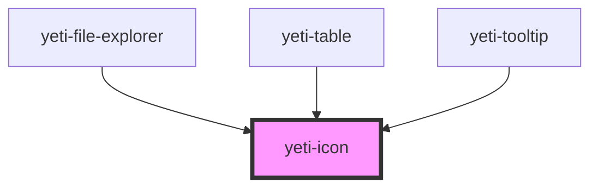

# yeti-icon

<!-- Auto Generated Below -->

## Properties

| Property    | Attribute    | Description                                                                                                                                                         | Type      | Default                    |
| ----------- | ------------ | ------------------------------------------------------------------------------------------------------------------------------------------------------------------- | --------- | -------------------------- |
| `alt`       | `alt`        | Optional replacement text to use as a more clear description of the icon for screen-reader users. Otherwise AT will announce the Google "code" (i.e. check_circle). | `string`  | `""`                       |
| `focusable` | `focusable`  | Whether the icon can gain focus (used primarily for tooltip anchors).                                                                                               | `boolean` | `false`                    |
| `iconCSS`   | `icon-css`   | CSS classlist applied to the actual element producing the icon.                                                                                                     | `string`  | `''`                       |
| `iconCode`  | `type`       | The type of icon. Corresponds to the analogous "code" Google uses (i.e. check_circle).                                                                              | `string`  | `'check_circle'`           |
| `iconId`    | `icon-id`    | id of the actual element producing the icon. Set to a unique id if one is not provided.                                                                             | `string`  | `utils.generateUniqueId()` |
| `iconStyle` | `icon-style` | The type of icon. Corresponds to the analogous "code" Google uses (i.e. check_circle).                                                                              | `string`  | `''`                       |

## Dependencies

### Used by

 - [yeti-file-explorer](../yeti-file-explorer)
 - [yeti-table](../yeti-table)
 - [yeti-tooltip](../yeti-tooltip)

### Graph

----------------------------------------------

*Built with [StencilJS](https://stenciljs.com/)*
