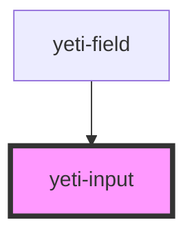

# yeti-input

<!-- Auto Generated Below -->

## Properties

| Property     | Attribute     | Description | Type      | Default                    |
| ------------ | ------------- | ----------- | --------- | -------------------------- |
| `inputClass` | `input-class` |             | `string`  | `''`                       |
| `inputId`    | `input-id`    |             | `string`  | `utils.generateUniqueId()` |
| `inputValue` | `input-value` |             | `string`  | `''`                       |
| `isValid`    | `is-valid`    |             | `boolean` | `true`                     |

## Events

| Event               | Description | Type                            |
| ------------------- | ----------- | ------------------------------- |
| `inputValueChanged` |             | `CustomEvent<CustomEvent<any>>` |
| `readyToVerifyFast` |             | `CustomEvent<CustomEvent<any>>` |
| `readyToVerifySlow` |             | `CustomEvent<CustomEvent<any>>` |

## Dependencies

### Used by

 - [yeti-field](../yeti-field)

### Graph

----------------------------------------------

*Built with [StencilJS](https://stenciljs.com/)*
