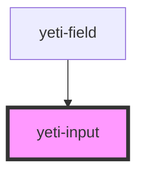

# yeti-input

<!-- Auto Generated Below -->

## Properties

| Property      | Attribute      | Description                                                                                        | Type      | Default                    |
| ------------- | -------------- | -------------------------------------------------------------------------------------------------- | --------- | -------------------------- |
| `describedBy` | `described-by` | id of an outside HTML element pointed to by the actual input element's aria-describedby attribute. | `string`  | `""`                       |
| `inputClass`  | `input-class`  | CSS classlist applied to the actual HTML input element.                                            | `string`  | `''`                       |
| `inputId`     | `input-id`     | id applied to the actual HTML input element.                                                       | `string`  | `utils.generateUniqueId()` |
| `inputName`   | `input-name`   | name applied to the actual HTML input element. Defaults to match id.                               | `string`  | `this.inputId`             |
| `isValid`     | `is-valid`     | Tracks whether the input's current value is valid or not.                                          | `boolean` | `undefined`                |
| `required`    | `required`     | Whether the field is required to have a valid value or not.                                        | `boolean` | `false`                    |
| `value`       | `value`        | The actual value of the input field.                                                               | `string`  | `''`                       |

## Events

| Event               | Description                                                                       | Type                            |
| ------------------- | --------------------------------------------------------------------------------- | ------------------------------- |
| `readyToVerifyFast` | Event that fires when the user enters or changes the contents of the input field. | `CustomEvent<CustomEvent<any>>` |
| `readyToVerifySlow` | Event that fires when the user leaves (blurs) the input field.                    | `CustomEvent<CustomEvent<any>>` |

## Dependencies

### Used by

 - [yeti-field](../yeti-field)

### Graph

----------------------------------------------

*Built with [StencilJS](https://stenciljs.com/)*
