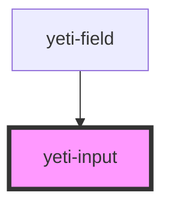

# yeti-input

<!-- Auto Generated Below -->

## Properties

| Property      | Attribute      | Description | Type      | Default                    |
| ------------- | -------------- | ----------- | --------- | -------------------------- |
| `describedBy` | `described-by` |             | `string`  | `""`                       |
| `inputClass`  | `input-class`  |             | `string`  | `''`                       |
| `inputId`     | `input-id`     |             | `string`  | `utils.generateUniqueId()` |
| `inputName`   | `input-name`   |             | `string`  | `this.inputId`             |
| `isValid`     | `is-valid`     |             | `boolean` | `undefined`                |
| `required`    | `required`     |             | `boolean` | `false`                    |
| `value`       | `value`        |             | `string`  | `''`                       |

## Events

| Event               | Description | Type                            |
| ------------------- | ----------- | ------------------------------- |
| `readyToVerifyFast` |             | `CustomEvent<CustomEvent<any>>` |
| `readyToVerifySlow` |             | `CustomEvent<CustomEvent<any>>` |

## Dependencies

### Used by

 - [yeti-field](../yeti-field)

### Graph

----------------------------------------------

*Built with [StencilJS](https://stenciljs.com/)*
