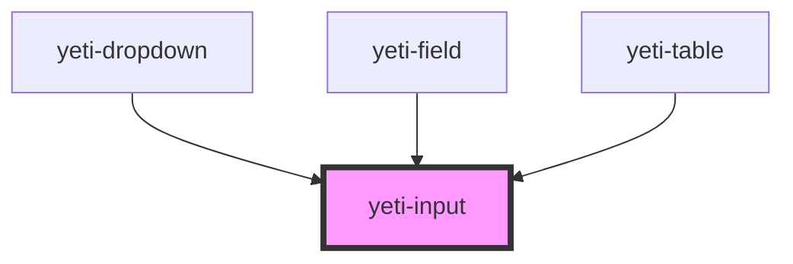

# yeti-input

<!-- Auto Generated Below -->

## Properties

| Property        | Attribute         | Description                                                                                        | Type      | Default                    |
| --------------- | ----------------- | -------------------------------------------------------------------------------------------------- | --------- | -------------------------- |
| `autocomplete`  | `autocomplete`    | Passthrough to the input's autocomplete attribute.                                                 | `string`  | `''`                       |
| `controls`      | `controls`        | id of an outside HTML element controlled by the input                                              | `string`  | `""`                       |
| `describedBy`   | `described-by`    | id of an outside HTML element pointed to by the actual input element's aria-describedby attribute. | `string`  | `""`                       |
| `description`   | `description`     | Text description of what the input is or does                                                      | `string`  | `""`                       |
| `inputClass`    | `input-class`     | CSS classlist applied to the actual HTML input element.                                            | `string`  | `''`                       |
| `inputId`       | `input-id`        | id applied to the actual HTML input element.                                                       | `string`  | `utils.generateUniqueId()` |
| `inputName`     | `input-name`      | name applied to the actual HTML input element. Defaults to match id.                               | `string`  | `this.inputId`             |
| `inputTabindex` | `input-tabindex`  | The tabindex of the input field.                                                                   | `string`  | `''`                       |
| `isValid`       | `is-valid`        | Tracks whether the input's current value is valid or not.                                          | `boolean` | `true`                     |
| `labeledBy`     | `labeled-by`      | id of an outside HTML element pointed to by the actual input element's aria-labeledby attribute.   | `string`  | `""`                       |
| `maxlength`     | `input-maxlength` | Optional attribute to set the maxlength of the field                                               | `number`  | `0`                        |
| `placeholder`   | `placeholder`     | Standard old-school input placeholder                                                              | `string`  | `""`                       |
| `required`      | `required`        | Whether the field is required to have a valid value or not.                                        | `boolean` | `false`                    |
| `type`          | `type`            | What type of input element this is; defaults to "text".                                            | `string`  | `"text"`                   |
| `value`         | `value`           | The actual value of the input field.                                                               | `string`  | `''`                       |
| `wrapperClass`  | `wrapper-class`   | CSS classlist applied to the HTML wrapper around the element and associated elements.              | `string`  | `''`                       |

## Events

| Event               | Description                                                                                     | Type               |
| ------------------- | ----------------------------------------------------------------------------------------------- | ------------------ |
| `readyToVerifyFast` | Event that fires when the user enters or changes the contents of the input field.               | `CustomEvent<any>` |
| `readyToVerifySlow` | Event that fires when the user leaves (blurs) the input field.                                  | `CustomEvent<any>` |
| `searchFieldClear`  | Event that fires when the field is a search field and the user hits the clear button within it. | `CustomEvent<any>` |

## Dependencies

### Used by

 - [yeti-dropdown](../yeti-dropdown)
 - [yeti-field](../yeti-field)
 - [yeti-table](../yeti-table)

### Graph

----------------------------------------------

*Built with [StencilJS](https://stenciljs.com/)*
