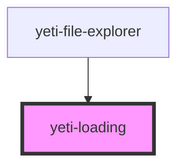

# yeti-tooltip

<!-- Auto Generated Below -->

## Properties

| Property   | Attribute   | Description                                                                                                     | Type      | Default |
| ---------- | ----------- | --------------------------------------------------------------------------------------------------------------- | --------- | ------- |
| `isActive` | `is-active` | Tracks whether the Loader is displaying or not.                                                                 | `boolean` | `false` |
| `isInline` | `is-inline` | Whether to display the Loading pattern inline or default mode.                                                  | `boolean` | `false` |
| `isModal`  | `is-modal`  | Whether to display the Loading pattern as a modal (covering its parent container) or as an inline-block object. | `boolean` | `false` |

## Dependencies

### Used by

 - [yeti-file-explorer](../yeti-file-explorer)

### Graph

----------------------------------------------

*Built with [StencilJS](https://stenciljs.com/)*
