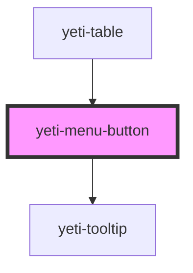

# yeti-menu-button

<!-- Auto Generated Below -->

## Properties

| Property        | Attribute        | Description | Type      | Default     |
| --------------- | ---------------- | ----------- | --------- | ----------- |
| `buttonCSS`     | `button-class`   |             | `string`  | `''`        |
| `buttonId`      | `button-id`      |             | `string`  | `""`        |
| `buttonType`    | `button-type`    |             | `string`  | `""`        |
| `describedBy`   | `described-by`   |             | `string`  | `""`        |
| `hasTooltip`    | `has-tooltip`    |             | `boolean` | `true`      |
| `labelledBy`    | `labelled-by`    |             | `string`  | `""`        |
| `menuAlignment` | `menu-alignment` |             | `string`  | `""`        |
| `menuCSS`       | `menu-class`     |             | `string`  | `''`        |
| `menuId`        | `menu-id`        |             | `string`  | `""`        |
| `tooltipText`   | `tooltip-text`   |             | `string`  | `"Options"` |
| `value`         | `value`          |             | `string`  | `''`        |
| `wrapperCSS`    | `wrapper-class`  |             | `string`  | `''`        |

## Events

| Event              | Description | Type               |
| ------------------ | ----------- | ------------------ |
| `menuButtonChange` |             | `CustomEvent<any>` |

## Dependencies

### Used by

 - [yeti-table](../yeti-table)

### Depends on

- [yeti-tooltip](../yeti-tooltip)

### Graph

----------------------------------------------

*Built with [StencilJS](https://stenciljs.com/)*
