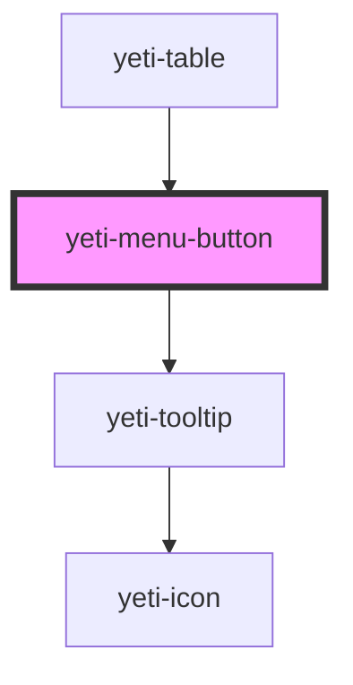

# yeti-menu-button

<!-- Auto Generated Below -->

## Properties

| Property        | Attribute        | Description                                                                                                                     | Type      | Default     |
| --------------- | ---------------- | ------------------------------------------------------------------------------------------------------------------------------- | --------- | ----------- |
| `buttonClass`   | `button-class`   | CSS classlist to add to the Menu Button's button element.                                                                       | `string`  | `''`        |
| `buttonId`      | `button-id`      | id to apply to the Menu Button's button element. Will be auto-populated with a unique id if one is not provided.                | `string`  | `""`        |
| `buttonType`    | `button-type`    | Sets a specific type of the button (see the Yeti Button pattern for more info): primary, secondary, tertiary, danger, or ghost. | `string`  | `""`        |
| `describedBy`   | `described-by`   | id of an outside element the control's aria-describedby attribute reference.                                                    | `string`  | `""`        |
| `hasTooltip`    | `has-tooltip`    | Whether to show a tooltip on hover/focus of the button or not.                                                                  | `boolean` | `true`      |
| `labelledBy`    | `labelled-by`    | id of an outside element the control's aria-labelledby attribute references.                                                    | `string`  | `""`        |
| `menuAlignment` | `menu-alignment` | Token list comprising left \| right and/or above \| below to align the menu relative to the button.                             | `string`  | `""`        |
| `menuClass`     | `menu-class`     | CSS classlist to add to the Menu Button's menu element.                                                                         | `string`  | `''`        |
| `menuId`        | `menu-id`        |                                                                                                                                 | `string`  | `""`        |
| `tooltipText`   | `tooltip-text`   | Text that appears within the optional tooltip bubble.                                                                           | `string`  | `"Options"` |
| `value`         | `value`          | The value of the control (will correspond to the value of one of the options in the menu).                                      | `string`  | `''`        |
| `wrapperClass`  | `wrapper-class`  | CSS classlist to add to the Menu Button pattern's outer wrapper.                                                                | `string`  | `''`        |

## Events

| Event                     | Description                                                                     | Type               |
| ------------------------- | ------------------------------------------------------------------------------- | ------------------ |
| `menuButtonChange`        | Fires when the selected value of the Menu Button becomes a different value.     | `CustomEvent<any>` |
| `menuButtonSelectionMade` | Fires whenever the user selects a value, even if its the same as it was before. | `CustomEvent<any>` |

## Dependencies

### Used by

 - [yeti-table](../yeti-table)

### Depends on

- [yeti-tooltip](../yeti-tooltip)

### Graph

----------------------------------------------

*Built with [StencilJS](https://stenciljs.com/)*
