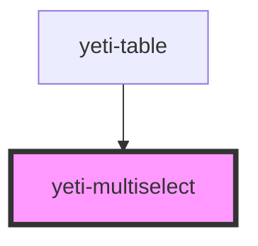

# yeti-multiselect

<!-- Auto Generated Below -->

## Properties

| Property        | Attribute        | Description | Type      | Default                    |
| --------------- | ---------------- | ----------- | --------- | -------------------------- |
| `actualId`      | `actual-id`      |             | `string`  | `utils.generateUniqueId()` |
| `cssClass`      | `css-class`      |             | `string`  | `''`                       |
| `describedBy`   | `described-by`   |             | `string`  | `""`                       |
| `htmlId`        | `html-id`        |             | `string`  | `utils.generateUniqueId()` |
| `htmlName`      | `html-name`      |             | `string`  | `this.htmlId`              |
| `isValid`       | `is-valid`       |             | `boolean` | `undefined`                |
| `labelledBy`    | `labelled-by`    |             | `string`  | `""`                       |
| `menuAlignment` | `menu-alignment` |             | `string`  | `""`                       |
| `placeholder`   | `placeholder`    |             | `string`  | `"-Select-"`               |
| `required`      | `required`       |             | `boolean` | `false`                    |
| `showClear`     | `show-clear`     |             | `boolean` | `true`                     |
| `value`         | `value`          |             | `string`  | `''`                       |

## Events

| Event               | Description | Type                            |
| ------------------- | ----------- | ------------------------------- |
| `readyToVerifyFast` |             | `CustomEvent<CustomEvent<any>>` |
| `readyToVerifySlow` |             | `CustomEvent<CustomEvent<any>>` |

## Dependencies

### Used by

 - [yeti-table](../yeti-table)

### Graph

----------------------------------------------

*Built with [StencilJS](https://stenciljs.com/)*
