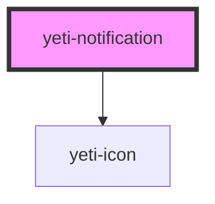

# yeti-toast

<!-- Auto Generated Below -->

## Properties

| Property         | Attribute         | Description                                                                                                                    | Type     | Default         |
| ---------------- | ----------------- | ------------------------------------------------------------------------------------------------------------------------------ | -------- | --------------- |
| `notificationId` | `notification-id` | id of the component's actual element corresponding to the tooltip. Will be auto-populated with a unique value if not provided. | `string` | `""`            |
| `slotId`         | `slot-id`         | id of the component's slot element.                                                                                            | `string` | `""`            |
| `textTitle`      | `text-title`      | Text value to display as the notification's title.                                                                             | `string` | `"Mmmm Toast!"` |
| `wrapperCSS`     | `wrapper-class`   | CSS classlist to add to the element serving as the component's wrapper.                                                        | `string` | `''`            |

## Dependencies

### Depends on

- [yeti-icon](../yeti-icon)

### Graph

----------------------------------------------

*Built with [StencilJS](https://stenciljs.com/)*
