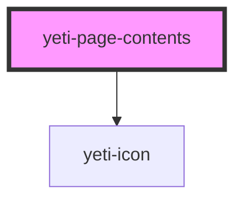

# yeti-tooltip

<!-- Auto Generated Below -->

## Properties

| Property       | Attribute       | Description                                                         | Type      | Default |
| -------------- | --------------- | ------------------------------------------------------------------- | --------- | ------- |
| `ignoreWithin` | `ignore-within` | Headings within a parent of the given class will be ignored.        | `string`  | `""`    |
| `isExpanded`   | `is-expanded`   | Whether to show the Page Contents menu in expanded or closed state. | `boolean` | `true`  |
| `wrapperId`    | `wrapper-id`    | Whether to show the Page Contents menu in expanded or closed state. | `string`  | `""`    |

## Dependencies

### Depends on

- [yeti-icon](../yeti-icon)

### Graph

----------------------------------------------

*Built with [StencilJS](https://stenciljs.com/)*
