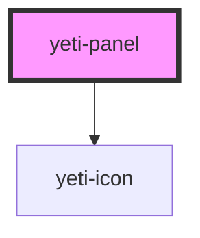

# yeti-accordion-section

<!-- Auto Generated Below -->

## Properties

| Property       | Attribute       | Description                                                                                                      | Type      | Default                    |
| -------------- | --------------- | ---------------------------------------------------------------------------------------------------------------- | --------- | -------------------------- |
| `contentId`    | `content-id`    | The id of the HTML element representing the panel's content container                                            | `string`  | `utils.generateUniqueId()` |
| `hasHeader`    | `has-header`    | Whether or not this panel has a header (it will have by default)                                                 | `boolean` | `true`                     |
| `headerId`     | `header-id`     | The id of the HTML element representing the panel header                                                         | `string`  | `utils.generateUniqueId()` |
| `heading`      | `heading`       | The descriptive text that appears in the heading bar above the content.                                          | `string`  | `'Heading'`                |
| `isExpandable` | `is-expandable` | Whether or not this panel can expand or collapse                                                                 | `boolean` | `false`                    |
| `isExpanded`   | `is-expanded`   | Whether or not this panel is currently expanded.                                                                 | `boolean` | `true`                     |
| `wrapperClass` | `wrapper-class` | A string of CSS space-separated CSS classes to add to the HTML element that represents the panel's outer wrapper | `string`  | `''`                       |

## Events

| Event                   | Description                                                             | Type               |
| ----------------------- | ----------------------------------------------------------------------- | ------------------ |
| `panelExpansionChanged` | Event that fires when the panel's isExpanded state changes to expanded. | `CustomEvent<any>` |

## Dependencies

### Depends on

- [yeti-icon](../yeti-icon)

### Graph

----------------------------------------------

*Built with [StencilJS](https://stenciljs.com/)*
