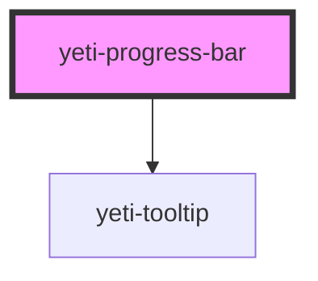

# yeti-progress-bar

<!-- Auto Generated Below -->

## Properties

| Property          | Attribute          | Description | Type      | Default                    |
| ----------------- | ------------------ | ----------- | --------- | -------------------------- |
| `barCSS`          | `bar-class`        |             | `string`  | `''`                       |
| `barId`           | `bar-id`           |             | `string`  | `utils.generateUniqueId()` |
| `error`           | `error`            |             | `boolean` | `false`                    |
| `helperText`      | `helper-text`      |             | `string`  | `""`                       |
| `label`           | `label`            |             | `string`  | `""`                       |
| `labelCSS`        | `label-class`      |             | `string`  | `''`                       |
| `progress`        | `progress`         |             | `number`  | `0`                        |
| `tooltipPosition` | `tooltip-position` |             | `string`  | `""`                       |
| `tooltipText`     | `tooltip-text`     |             | `string`  | `""`                       |
| `wrapperCSS`      | `wrapper-class`    |             | `string`  | `''`                       |

## Dependencies

### Depends on

- [yeti-tooltip](../yeti-tooltip)

### Graph

----------------------------------------------

*Built with [StencilJS](https://stenciljs.com/)*
