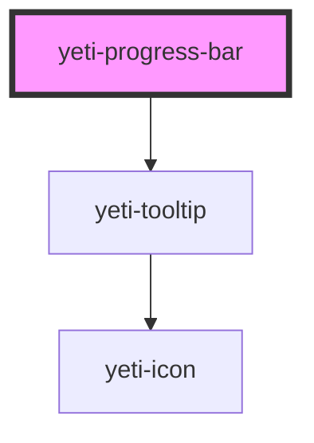

# yeti-progress-bar

<!-- Auto Generated Below -->

## Properties

| Property          | Attribute          | Description                                                                                                                    | Type      | Default |
| ----------------- | ------------------ | ------------------------------------------------------------------------------------------------------------------------------ | --------- | ------- |
| `barCSS`          | `bar-class`        | CSS classlist to add to the element representing the component's progress bar.                                                 | `string`  | `''`    |
| `barId`           | `bar-id`           | id of the element representing the component's progress bar. Will be given an auto-generated unique id if one is not provided. | `string`  | `""`    |
| `error`           | `error`            | Whether or not the bar should depict an error state.                                                                           | `boolean` | `false` |
| `helperText`      | `helper-text`      | Text content that appears beneath the bar as helper text.                                                                      | `string`  | `""`    |
| `label`           | `label`            | Text content for the component's label.                                                                                        | `string`  | `""`    |
| `labelCSS`        | `label-class`      | CSS classlist to add to the component's actual label element.                                                                  | `string`  | `''`    |
| `progress`        | `progress`         | Number between 0 and 100 that describes the percentage complete to display in the bar.                                         | `number`  | `0`     |
| `tooltipPosition` | `tooltip-position` | Token list describing the component's tooltip's position relative to the bar: left \| right and/or above \| below.             | `string`  | `""`    |
| `tooltipText`     | `tooltip-text`     | Text content for the component's tooltip.                                                                                      | `string`  | `""`    |
| `wrapperCSS`      | `wrapper-class`    | CSS classlist to add to the component's outer wrapper element.                                                                 | `string`  | `''`    |

## Dependencies

### Depends on

- [yeti-tooltip](../yeti-tooltip)

### Graph

----------------------------------------------

*Built with [StencilJS](https://stenciljs.com/)*
