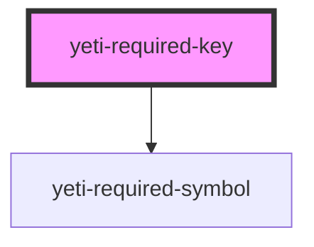

# yeti-required-key

<!-- Auto Generated Below -->

## Properties

| Property            | Attribute             | Description                                       | Type      | Default |
| ------------------- | --------------------- | ------------------------------------------------- | --------- | ------- |
| `allFieldsRequired` | `all-fields-required` | Whether all fields are required (default) or not. | `boolean` | `true`  |
| `cssClass`          | `css-class`           | CSS classlist applied to the wrapper element.     | `string`  | `''`    |

## Dependencies

### Depends on

- [yeti-required-symbol](../yeti-required-symbol)

### Graph

----------------------------------------------

*Built with [StencilJS](https://stenciljs.com/)*
