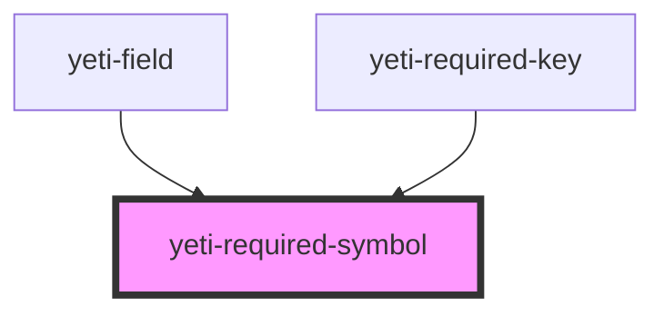

# yeti-required-symbol

<!-- Auto Generated Below -->

## Properties

| Property   | Attribute   | Description                                                                               | Type     | Default      |
| ---------- | ----------- | ----------------------------------------------------------------------------------------- | -------- | ------------ |
| `alt`      | `alt`       | Alternative text announced by screen-readers; set to an empty string to announce nothing. | `string` | `'Required'` |
| `cssClass` | `css-class` | CSS classlist applied to the element.                                                     | `string` | `''`         |

## Dependencies

### Used by

 - [yeti-field](../yeti-field)
 - [yeti-required-key](../yeti-required-key)

### Graph

----------------------------------------------

*Built with [StencilJS](https://stenciljs.com/)*
