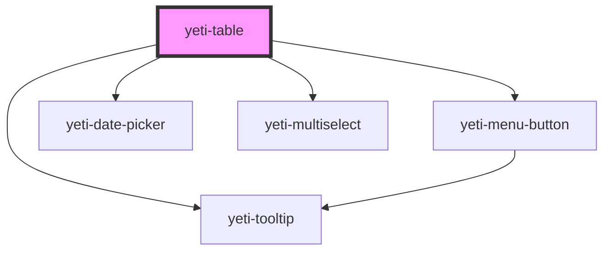

# yeti-table

<!-- Auto Generated Below -->

## Properties

| Property        | Attribute         | Description                                                                                | Type                | Default                                                                    |
| --------------- | ----------------- | ------------------------------------------------------------------------------------------ | ------------------- | -------------------------------------------------------------------------- |
| `contents`      | --                |                                                                                            | `YetiTableContents` | `{     head: {       rows: []     },     body: {       rows: []     }   }` |
| `filterSelf`    | `filter-self`     | Determines whether to handle filtering (true) or just note the user requested it (false).  | `boolean`           | `true`                                                                     |
| `noMatchesText` | `no-matches-text` |                                                                                            | `string`            | `"No matches"`                                                             |
| `paginateSelf`  | `paginate-self`   | Determines whether to handle pagination (true) or just note the user requested it (false). | `boolean`           | `true`                                                                     |
| `records`       | `records`         |                                                                                            | `number`            | `0`                                                                        |
| `sortSelf`      | `sort-self`       | Determines whether to handle sorting (true) or just note the user requested it (false).    | `boolean`           | `true`                                                                     |
| `tableClass`    | `table-class`     |                                                                                            | `string`            | `''`                                                                       |
| `tableId`       | `table-id`        |                                                                                            | `string`            | `utils.generateUniqueId()`                                                 |

## Events

| Event            | Description | Type               |
| ---------------- | ----------- | ------------------ |
| `rowActionClick` |             | `CustomEvent<any>` |
| `tableFilter`    |             | `CustomEvent<any>` |
| `tablePaginate`  |             | `CustomEvent<any>` |
| `tableSort`      |             | `CustomEvent<any>` |

## Dependencies

### Depends on

- [yeti-menu-button](../yeti-menu-button)
- [yeti-tooltip](../yeti-tooltip)
- [yeti-date-picker](../yeti-date-picker)
- [yeti-multiselect](../yeti-multiselect)

### Graph

----------------------------------------------

*Built with [StencilJS](https://stenciljs.com/)*
