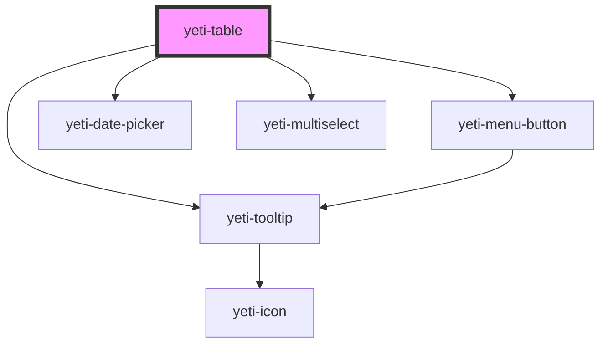

# yeti-table

<!-- Auto Generated Below -->

## Properties

| Property        | Attribute         | Description                                                                                                  | Type                | Default                                                                    |
| --------------- | ----------------- | ------------------------------------------------------------------------------------------------------------ | ------------------- | -------------------------------------------------------------------------- |
| `contents`      | --                | Unique type that captures the table's contents and configurable state information. See utils.ts for details. | `YetiTableContents` | `{     head: {       rows: []     },     body: {       rows: []     }   }` |
| `filterSelf`    | `filter-self`     | Determines whether to handle filtering (true) or just note the user requested it (false).                    | `boolean`           | `true`                                                                     |
| `noMatchesText` | `no-matches-text` | Placeholder text when filtering returns no matching records.                                                 | `string`            | `"No matches"`                                                             |
| `paginateSelf`  | `paginate-self`   | Determines whether to handle pagination (true) or just note the user requested it (false).                   | `boolean`           | `true`                                                                     |
| `records`       | `records`         | Number of table records                                                                                      | `number`            | `0`                                                                        |
| `sortSelf`      | `sort-self`       | Determines whether to handle sorting (true) or just note the user requested it (false).                      | `boolean`           | `true`                                                                     |
| `tableClass`    | `table-class`     | CSS classlist that will be added to the actual html table element.                                           | `string`            | `''`                                                                       |
| `tableId`       | `table-id`        | id that will be assigned to the actual html table element.                                                   | `string`            | `utils.generateUniqueId()`                                                 |

## Events

| Event             | Description                                                                                                                                                                                             | Type               |
| ----------------- | ------------------------------------------------------------------------------------------------------------------------------------------------------------------------------------------------------- | ------------------ |
| `cellRadioChange` | Fires when an isRadio cell changes value.                                                                                                                                                               | `CustomEvent<any>` |
| `rowActionClick`  | Fires when user chooses an option from the optional Menu Button component.                                                                                                                              | `CustomEvent<any>` |
| `tableFilter`     | Fires when user updates a column filter. This only fires when filterSelf is false (i.e. some logic outside the component will handle filtering and presumably update the table's contents).             | `CustomEvent<any>` |
| `tablePaginate`   | Fires when user chooses a different page of data. This only fires when paginateSelf is false (i.e. some logic outside the component will handle pagination and presumably update the table's contents). | `CustomEvent<any>` |
| `tableSort`       | Fires when user clicks a sortable header. This only fires when sortSelf is false (i.e. some logic outside the component will handle sorting and presumably update the table's contents).                | `CustomEvent<any>` |

## Dependencies

### Depends on

- [yeti-menu-button](../yeti-menu-button)
- [yeti-tooltip](../yeti-tooltip)
- [yeti-date-picker](../yeti-date-picker)
- [yeti-multiselect](../yeti-multiselect)

### Graph

----------------------------------------------

*Built with [StencilJS](https://stenciljs.com/)*
