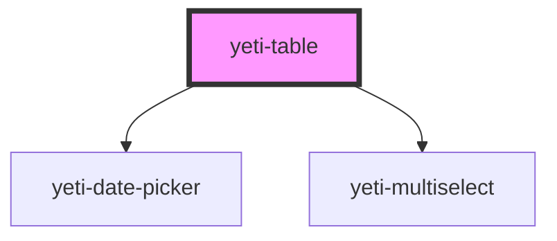

# yeti-input

<!-- Auto Generated Below -->

## Properties

| Property     | Attribute     | Description | Type                | Default                                                                                                                                                                                                                                                                                                                            |
| ------------ | ------------- | ----------- | ------------------- | ---------------------------------------------------------------------------------------------------------------------------------------------------------------------------------------------------------------------------------------------------------------------------------------------------------------------------------- |
| `contents`   | --            |             | `YetiTableContents` | `{     head: {       rows: [         {           cells: [             {               value: "Data"             }           ]         }       ]     },      body: {       rows: [         {           cells: [             {               value: "This table has no data."             }           ]         }       ]     }   }` |
| `isValid`    | `is-valid`    |             | `boolean`           | `true`                                                                                                                                                                                                                                                                                                                             |
| `tableClass` | `table-class` |             | `string`            | `''`                                                                                                                                                                                                                                                                                                                               |
| `tableId`    | `table-id`    |             | `string`            | `utils.generateUniqueId()`                                                                                                                                                                                                                                                                                                         |

## Dependencies

### Depends on

- [yeti-date-picker](../yeti-date-picker)
- [yeti-multiselect](../yeti-multiselect)

### Graph

----------------------------------------------

*Built with [StencilJS](https://stenciljs.com/)*
