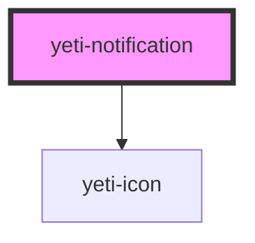

# yeti-toast

<!-- Auto Generated Below -->

## Properties

| Property          | Attribute            | Description                                                                                                                         | Type      | Default                  |
| ----------------- | -------------------- | ----------------------------------------------------------------------------------------------------------------------------------- | --------- | ------------------------ |
| `blockAnchor`     | `block-anchor`       | Whether the anchor should be forced to be a CSS display block style or left as is.                                                  | `boolean` | `false`                  |
| `clickToOpen`     | `click-to-open`      | Token list to describe the notification's position relative to its anchor: left \| right and/or above \| below.                     | `boolean` | `false`                  |
| `forceOpen`       | `force-open`         | Whether the notification should remain open permanently.                                                                            | `boolean` | `false`                  |
| `notificationCSS` | `notification-class` | CSS classlist to add to the actual notification element.                                                                            | `string`  | `''`                     |
| `slotId`          | `slot-id`            | id of the component's slot element.                                                                                                 | `string`  | `""`                     |
| `text`            | `text`               |   /**   Text value to display as the notification contents.                                                                         | `string`  | `"I'm helpful text."`    |
| `texttitle`       | `texttitle`          | Text value to display as the notification's contents.                                                                               | `string`  | `"I'm a helpful title."` |
| `tipId`           | `tip-id`             | id of the component's actual element corresponding to the notification. Will be auto-populated with a unique value if not provided. | `string`  | `""`                     |
| `wrapperCSS`      | `wrapper-class`      | CSS classlist to add to the element serving as the component's wrapper.                                                             | `string`  | `''`                     |

## Dependencies

### Depends on

- [yeti-icon](../yeti-icon)

### Graph

----------------------------------------------

*Built with [StencilJS](https://stenciljs.com/)*
