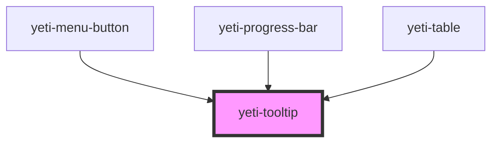

# yeti-tooltip

<!-- Auto Generated Below -->

## Properties

| Property      | Attribute       | Description | Type      | Default                    |
| ------------- | --------------- | ----------- | --------- | -------------------------- |
| `blockAnchor` | `block-anchor`  |             | `boolean` | `false`                    |
| `position`    | `position`      |             | `string`  | `"above"`                  |
| `slotId`      | `slot-id`       |             | `string`  | `utils.generateUniqueId()` |
| `text`        | `text`          |             | `string`  | `"I'm a helpful tooltip."` |
| `tipId`       | `tip-id`        |             | `string`  | `utils.generateUniqueId()` |
| `tooltipCSS`  | `tooltip-class` |             | `string`  | `''`                       |
| `wrapperCSS`  | `wrapper-class` |             | `string`  | `''`                       |

## Dependencies

### Used by

 - [yeti-menu-button](../yeti-menu-button)
 - [yeti-progress-bar](../yeti-progress-bar)
 - [yeti-table](../yeti-table)

### Graph

----------------------------------------------

*Built with [StencilJS](https://stenciljs.com/)*
