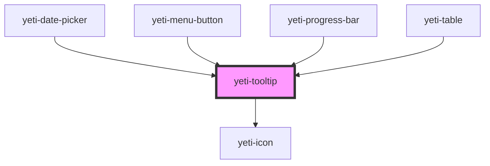

# yeti-tooltip

<!-- Auto Generated Below -->

## Properties

| Property      | Attribute       | Description                                                                                                                    | Type      | Default                    |
| ------------- | --------------- | ------------------------------------------------------------------------------------------------------------------------------ | --------- | -------------------------- |
| `blockAnchor` | `block-anchor`  | Whether the anchor should be forced to be a CSS display block style or left as is.                                             | `boolean` | `false`                    |
| `clickToOpen` | `click-to-open` | Token list to describe the tooltip's position relative to its anchor: left \| right and/or above \| below.                     | `boolean` | `false`                    |
| `forceOpen`   | `force-open`    | Whether the tooltip should remain open permanently.                                                                            | `boolean` | `false`                    |
| `position`    | `position`      | Token list to describe the tooltip's position relative to its anchor: left \| right and/or above \| below.                     | `string`  | `"above"`                  |
| `slotId`      | `slot-id`       | id of the component's slot element.                                                                                            | `string`  | `""`                       |
| `text`        | `text`          | Text value to display as the tooltip's contents.                                                                               | `string`  | `"I'm a helpful tooltip."` |
| `tipId`       | `tip-id`        | id of the component's actual element corresponding to the tooltip. Will be auto-populated with a unique value if not provided. | `string`  | `""`                       |
| `tooltipCSS`  | `tooltip-class` | CSS classlist to add to the actual tooltip element.                                                                            | `string`  | `''`                       |
| `wrapperCSS`  | `wrapper-class` | CSS classlist to add to the element serving as the component's wrapper.                                                        | `string`  | `''`                       |

## Dependencies

### Used by

 - [yeti-date-picker](../yeti-date-picker)
 - [yeti-menu-button](../yeti-menu-button)
 - [yeti-progress-bar](../yeti-progress-bar)
 - [yeti-table](../yeti-table)

### Depends on

- [yeti-icon](../yeti-icon)

### Graph

----------------------------------------------

*Built with [StencilJS](https://stenciljs.com/)*
