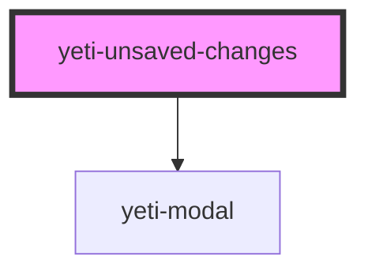

# yeti-unsaved-changes

<!-- Auto Generated Below -->

## Properties

| Property         | Attribute          | Description                           | Type      | Default |
| ---------------- | ------------------ | ------------------------------------- | --------- | ------- |
| `formHasChanges` | `form-has-changes` | id of the form element we're watching | `boolean` | `false` |
| `formId`         | `form-id`          | id of the form element we're watching | `string`  | `""`    |
| `isOpen`         | `is-open`          | id of the form element we're watching | `boolean` | `false` |

## Dependencies

### Depends on

- [yeti-modal](../yeti-modal)

### Graph

----------------------------------------------

*Built with [StencilJS](https://stenciljs.com/)*
