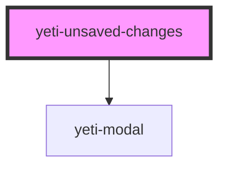

# yeti-unsaved-changes

<!-- Auto Generated Below -->

## Properties

| Property         | Attribute          | Description                                                                  | Type      | Default |
| ---------------- | ------------------ | ---------------------------------------------------------------------------- | --------- | ------- |
| `formHasChanges` | `form-has-changes` | whether or not the form has changed since page load                          | `boolean` | `false` |
| `formId`         | `form-id`          | id of the form element we're watching                                        | `string`  | `""`    |
| `isEnabled`      | `is-enabled`       | whether or not the component will prompt the user before they leave the page | `boolean` | `true`  |
| `isOpen`         | `is-open`          | whether or not the Unsaved Changes modal is currently open                   | `boolean` | `false` |

## Dependencies

### Depends on

- [yeti-modal](../yeti-modal)

### Graph

----------------------------------------------

*Built with [StencilJS](https://stenciljs.com/)*
